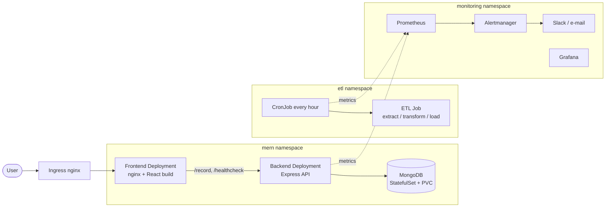
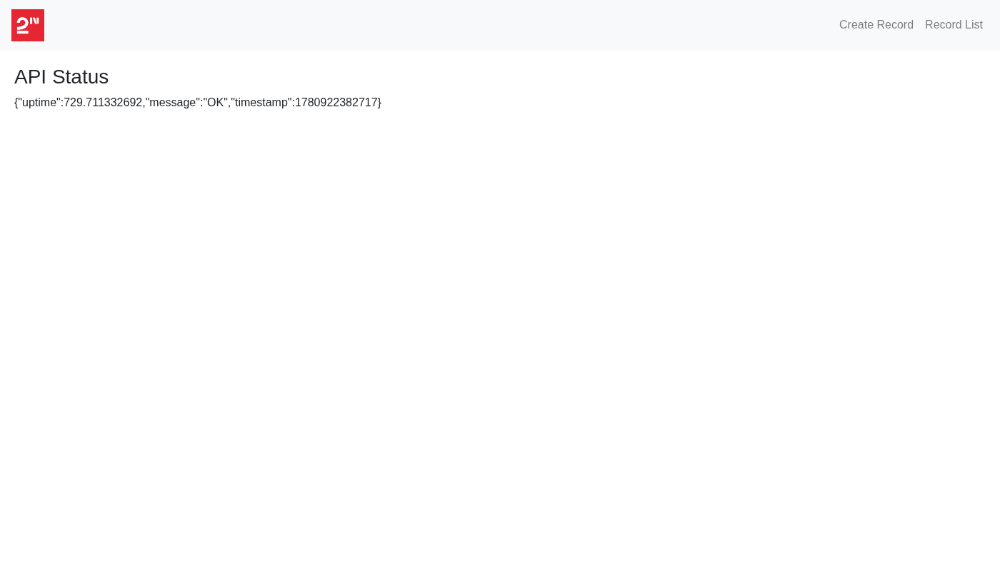
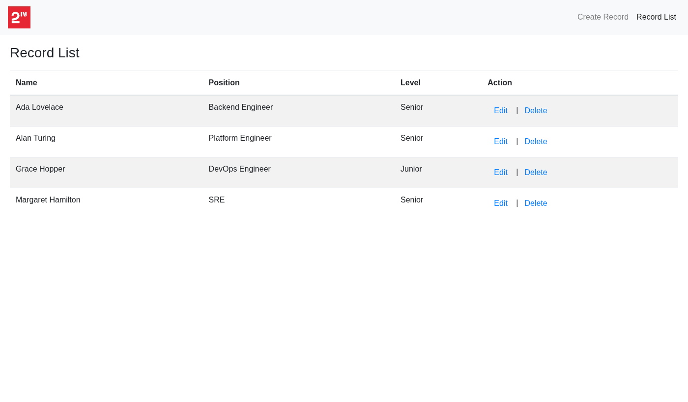
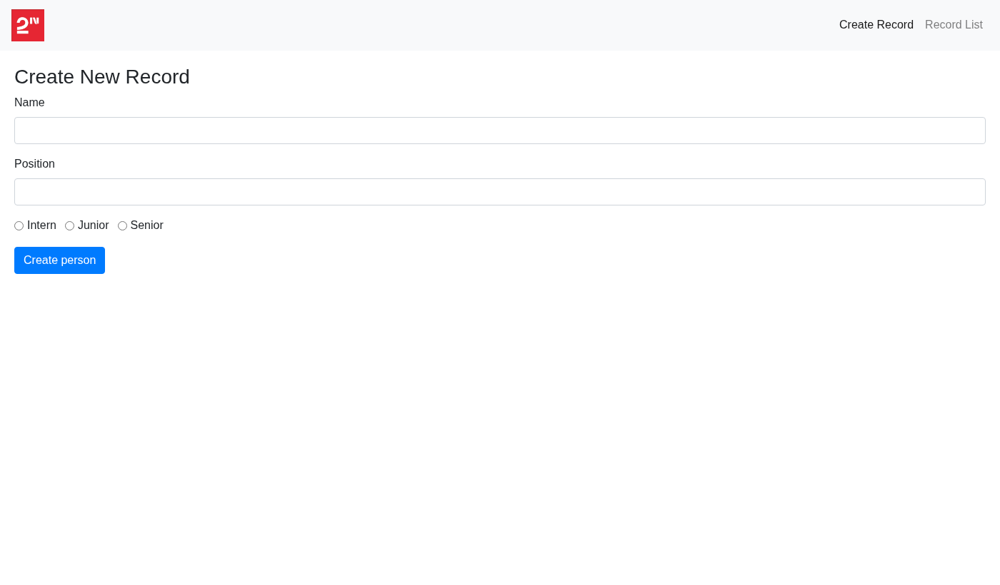
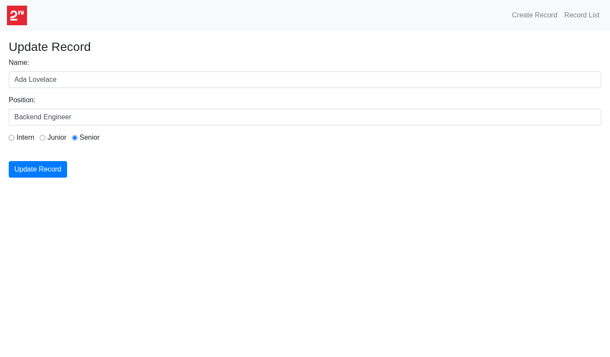
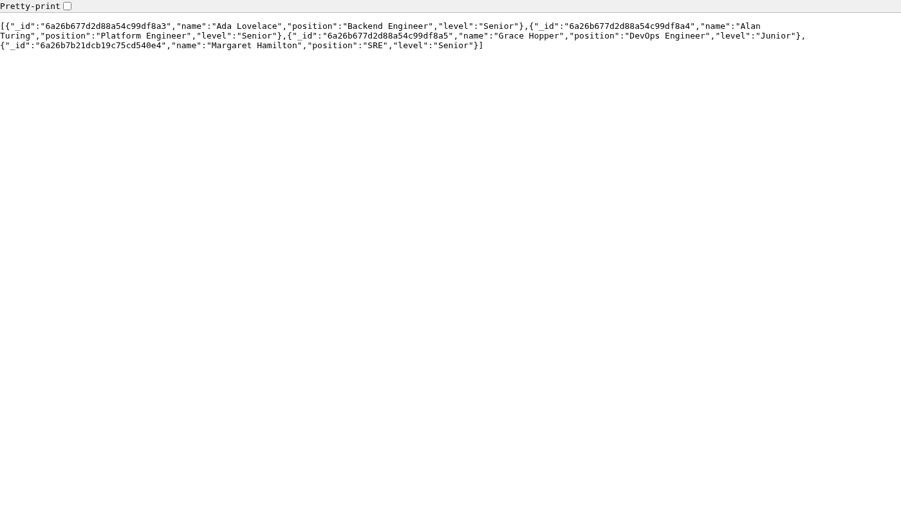
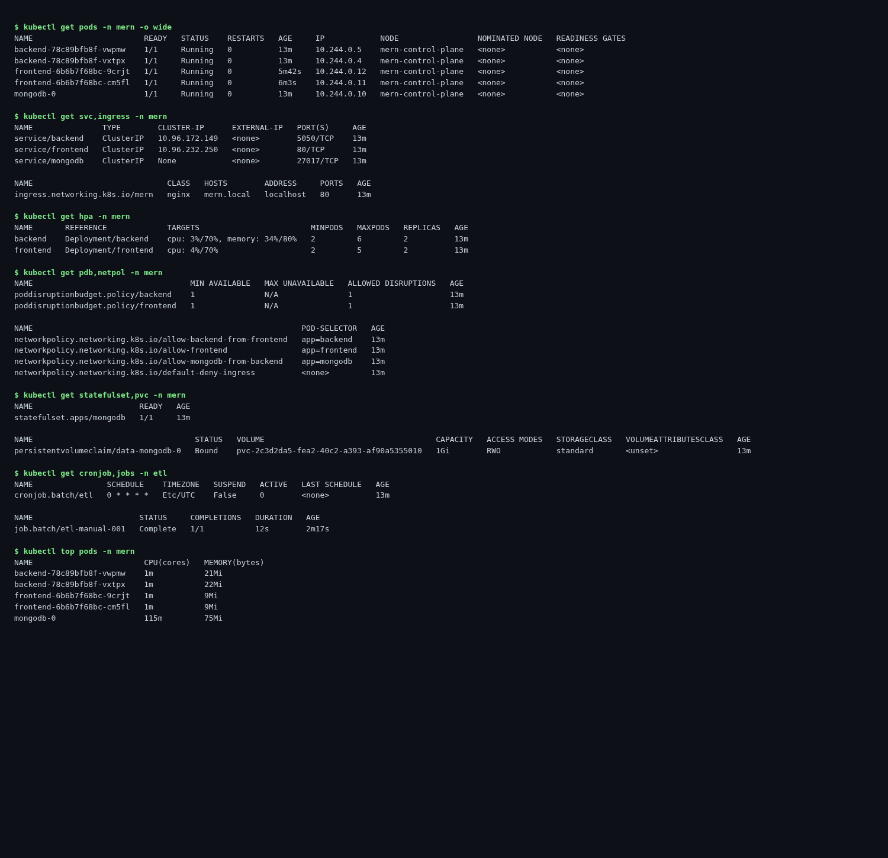
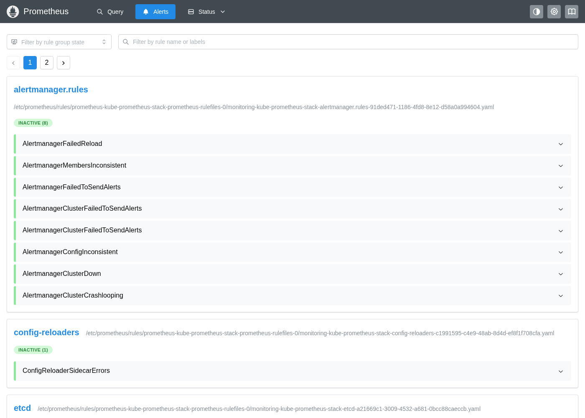
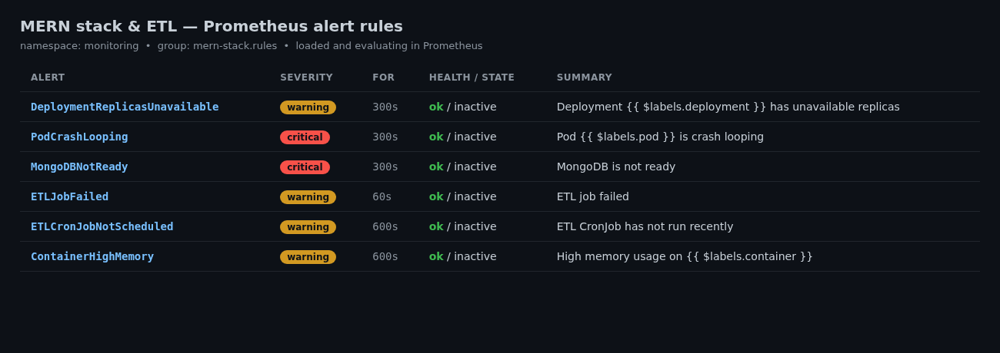

# DevOps Case — MERN Stack & Python ETL

**Repository:** https://github.com/kanemoda/devops-case

This repository contains two deployable workloads and all the infrastructure,
orchestration, CI/CD and observability needed to run them:

- **MERN project** — a React frontend, an Express/Node API and a MongoDB database.
- **Python project** — an ETL script that runs on a schedule (every hour).

Both are containerised, orchestrated on Kubernetes, built and shipped through
GitHub Actions, provisioned on AWS with Terraform, and monitored with
Prometheus / Grafana / Alertmanager.

---

## Architecture



The frontend container serves the static React build and reverse-proxies API
calls (`/record`, `/healthcheck`) to the backend Service, so the browser only
ever talks to one origin. The backend reads its MongoDB connection string from a
Kubernetes Secret and exposes a DB-backed readiness probe. See
[docs/architecture.md](docs/architecture.md) for the full breakdown.

---

## Repository layout

```
.
├── mern-project/
│   ├── client/              React app + Dockerfile + nginx.conf
│   ├── server/              Express API + Dockerfile
│   ├── mongo-init/          seed data for local runs
│   ├── docker-compose.yml   local stack (frontend + backend + mongo)
│   └── k8s/                 namespace, mongo, backend, frontend, ingress,
│                            HPA, PDB, NetworkPolicy, kustomization
├── python-project/
│   ├── ETL.py               extract / transform / load
│   ├── Dockerfile
│   └── k8s/                 namespace + hourly CronJob
├── terraform/               AWS VPC + EKS + ECR
├── monitoring/              kube-prometheus-stack values + alert rules
├── local/                   kind config + one-shot deploy script
├── .github/workflows/       CI/CD for both projects
└── docs/                    architecture, deployment, challenges, screenshots
```

---

## Quick start

### Option A — Docker Compose (fastest)

```bash
cd mern-project
docker compose up -d --build
# open http://localhost:3000
```

### Option B — Local Kubernetes (kind)

```bash
./local/deploy-kind.sh
kubectl -n mern port-forward svc/frontend 3000:80
# open http://localhost:3000
```

The script creates a kind cluster, builds and loads the images, installs
ingress-nginx and metrics-server, and applies all manifests. Full step-by-step
instructions (including AWS/EKS) are in [docs/deployment.md](docs/deployment.md).

---

## Acceptance criteria

### MERN project
| Requirement | Status |
|---|---|
| MongoDB connected | ✅ readiness probe `/healthcheck/ready` returns `ready`; records persist |
| All endpoints work | ✅ `/healthcheck`, `/healthcheck/ready`, `/record` GET/POST/PATCH/DELETE |
| All pages work | ✅ API status, Record List, Create, Edit |

### Python project
| Requirement | Status |
|---|---|
| ETL.py runs every hour | ✅ Kubernetes CronJob `0 * * * *` (plus a scheduled GitHub Actions fallback) |

---

## Running system (screenshots)

Captured from the application running on a Kubernetes cluster.

**Frontend — API status (live backend health response)**


**Frontend — Record List (data served from MongoDB)**


**Frontend — Create record**


**Frontend — Edit record (form populated from `GET /record/:id`)**


**Backend API — `GET /record/`**


**Kubernetes — cluster state (pods, services, HPA, PDB, NetworkPolicy, PVC, CronJob)**


**Monitoring — Prometheus alerts UI (rules loaded and evaluating)**


**Monitoring — application & ETL alert rules**


---

## CI/CD

GitHub Actions pipelines (`.github/workflows/`):

- **mern-ci-cd.yml** — builds the client, syntax-checks the server, runs the
  Cypress end-to-end suite against a Compose stack, then builds and pushes both
  images and deploys to EKS on `main`. Image builds are gated on the E2E tests.
- **etl-ci-cd.yml** — lints and compiles the ETL, builds and pushes its image,
  then updates the CronJob on EKS.
- **etl-scheduled.yml** — runs the ETL hourly directly on a GitHub-hosted runner
  as a serverless alternative to the in-cluster CronJob.

Deployment jobs are gated on the `DEPLOY_ENABLED` repository variable and use
`AWS_*` / `EKS_CLUSTER_NAME` secrets, so forks build without trying to deploy.

---

## Infrastructure (Terraform)

`terraform/` provisions an AWS VPC (public/private subnets, NAT), an EKS cluster
with a managed node group, and ECR repositories for the three images.

```bash
cd terraform
terraform init
terraform apply
```

---

## Security highlights

- Containers run as non-root with `readOnlyRootFilesystem`, dropped Linux
  capabilities and the `RuntimeDefault` seccomp profile.
- Secrets are kept in Kubernetes Secrets (and AWS Secrets Manager / SOPS in
  production), never baked into images.
- NetworkPolicies enforce least-privilege traffic between frontend, backend and
  MongoDB.
- ECR image scanning on push; pinned base images and dependency lockfiles.
- TLS terminated at the ingress in production (cert-manager + Let's Encrypt); the
  local demo runs HTTP. See [docs/deployment.md](docs/deployment.md#tls--https).

See [docs/challenges.md](docs/challenges.md) for the engineering decisions and
problems solved along the way.
